## Amazon Elastic Compute Cloud (Amazon EC2) 
is a web service that provides secure, resizable compute capacity in the cloud.
It is designed to make web-scale cloud computing easier for developers.
Amazon EC2’s simple web service interface allows you to obtain and configure capacity with minimal friction.
It provides you with complete control of your computing resources and lets you run on Amazon’s proven computing environment.

## Reliable, Scalable, Infrastructure On Demand

* Increase or decrease capacity within minutes, not hours or days
* SLA commitment of 99.99% availability for each Amazon EC2 region.
  Each region consists of at least 3 availability zones
* The AWS Region/AZ model has been recognized by Gartner as the recommended 
  approach for running enterprise applications that require high availability
  
 # How to Create an EC2 Instance for AWS.
 The process for creating an EC2 instance when using AWS can become quite complex. 
 You can manually create key pairs used to log in to the instance, 
 for example, or create a special security group to help maintain EC2 security.
 In addition, you can use a custom AMI to configure your instance. 
 The problem is that all these extra steps make what should be a relatively 
 simple process for experimentation purposes quite difficult.
 
 ## How to Create EC2 Instance in AWS: Step by Step Tutorial 
 
 ## 1. *Login and access to AWS services*
 
 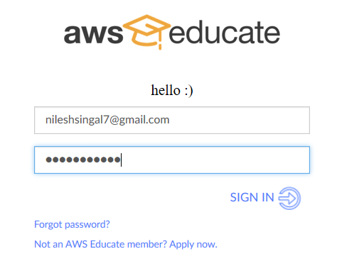
 
 ## 2. *After sucessfull login go to your classroom*
 
 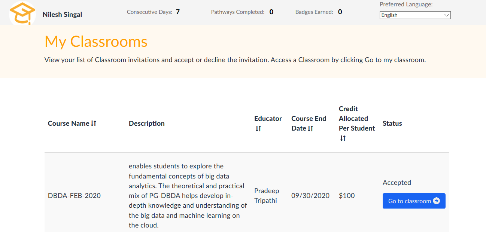
 
 ## 3. *Then Go to AWS CONSOLE*
 
 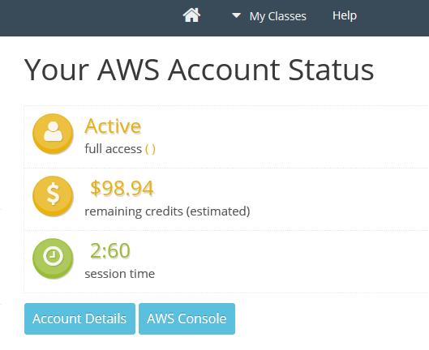
 
 
 ## 4. *Go To Services* 
 
 
 
 ## 5. *Select First Option EC2*
 
 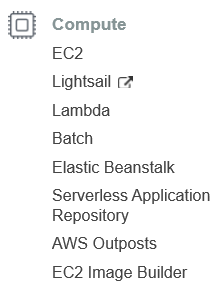
 
 ## 6. *Now Launch Instance*
 From the Amazon EC2 dashboard, choose Launch Instance.
 
 
 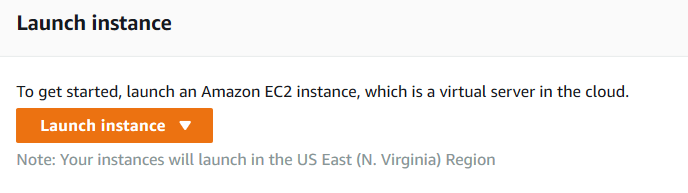
 
 ## Step 1: Choose an Amazon Machine Image (AMI)
 The Choose an Amazon Machine Image (AMI) page displays a list of basic configurations called Amazon Machine Images (AMIs) that serve as templates for your instance. Select the HVM edition of the Amazon Linux AMI. Notice that this configuration is marked Free tier eligible. 
 
 You can search for required **Operating System**, In This Demo we will create instance of Linux
 select the first option **Amazon Linux 2 AMI (HVM), SSD Volume Type**
 If You are creating windows Instance ,**Volume Should be >= 50 GB**
 you will be charged per hour for windows you also have to pay for licence(**per hr**)(**pay as you use**)
 
 
 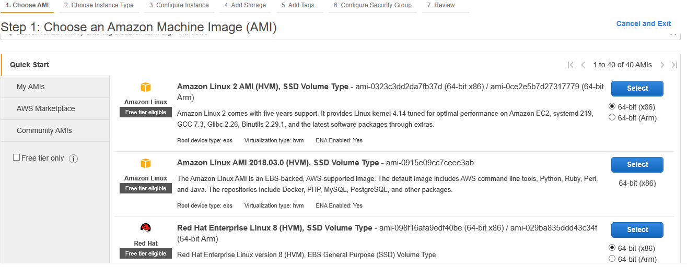
 
 
 ## Step 2: Choose an Instance Type
 I have selected t2.micro which has 1 cpu and 1gb RAM,
 We can change it later as per our requirnment
 Tap **Next: Configure**
 
 
 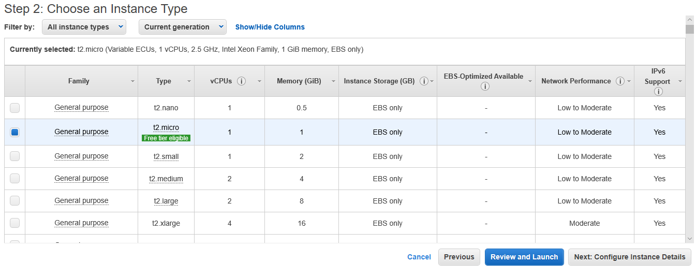
 
 
 ## Step 3: Configure Instance Details
 leave it **Default**
 **Choose Next: Add Storage.**
 
  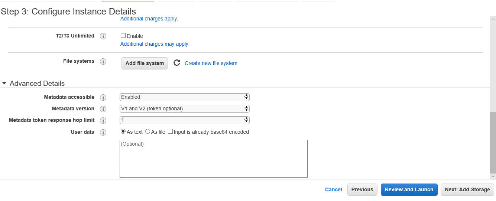
  
  ## Step 4: Add Storage
  In this tutorial our Volume is of 30GB, keeping in mind that you have to pay for storage even if your instance is on stopped state
  
   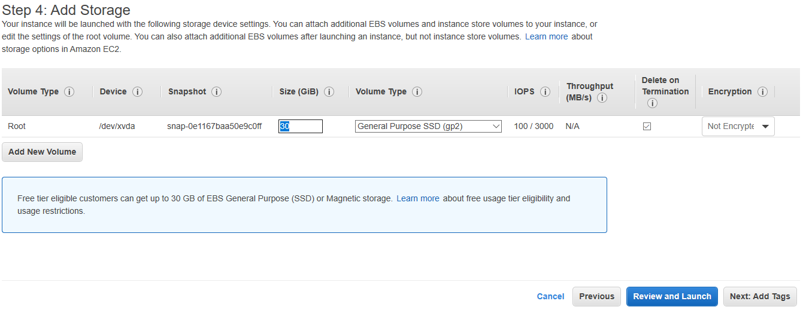
   
   ## Step 5: Add Tags
   
   If you have Multiple instances , tag are very helpfull to recognize which is what
   For ex: if You are creating windows instance you can add Tag Name Windows or of your choice to that help you to identify
   the instance
   Choose **Next: Configure Security Group.**
   
  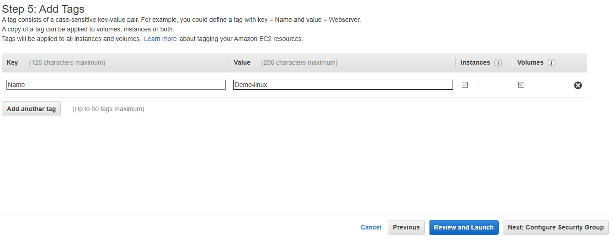
  
  ## Step 6: Configure Security Group
  
  Choose Select an existing security group.
  In the list of security groups, choose default. This is the default security group for your VPC. 
  **Choose Next: Review and Launch. **
  
  
  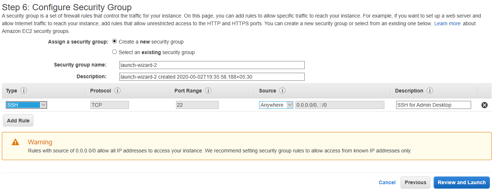
  
  ## Step 7: Review Instance Launch
  **Choose Launch**
  
  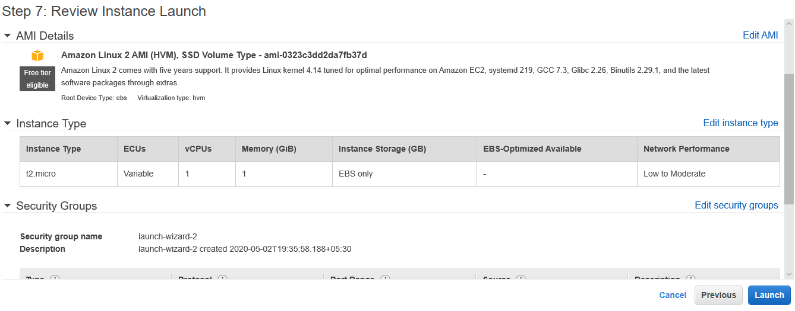
  
  ## 7. In the Select an existing key pair or create a new key pair window, do one of the following: 
  
  - If you don't have an Amazon EC2 key pair, choose Create a new key pair and follow the instructions. You are asked to download a private key file (.pem file). You need this file later when you log in to your Amazon EC2 instance. 
  
  - If you already have an existing Amazon EC2 key pair, go to Select a key pair and choose your key pair from the list. You must already have the private key file (.pem file) available in order to log in to your Amazon EC2 instance. 
  
  
  
  
  
  **VERY IMPORTANT**
  Download  .pem file and **save** this file ,if you delete or damage this file **you will not able to access your instance**
  After configuring your key pair, choose **Launch Instances.**
  
  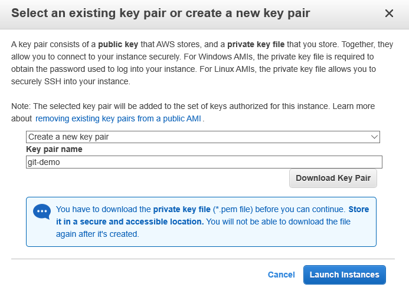
  
  ## 8. Initiating Instance Launches
  
  
  
  
  **It will take some time be calm **
  
  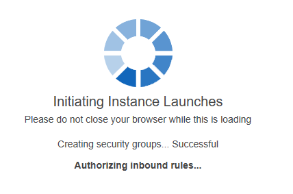
  
  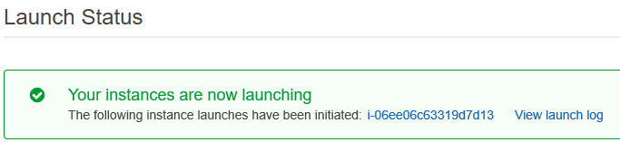
  
  
  ## 9. How To Connect  To Your Instance
  
  
  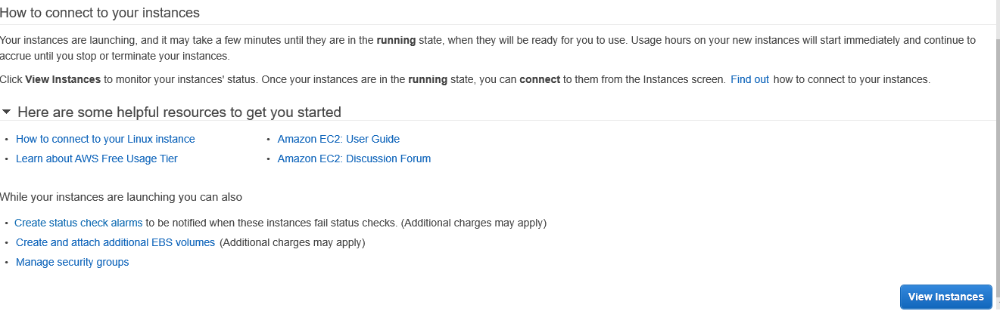
  
  
  Choose **View Instance**
  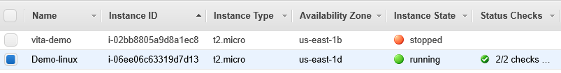
  
  now you have succesfully created ec2 instance 

 ## Very Important 
 Ec-2 is pay as You use , now we had created linux instance the billing is as we use we have to pay per hr
 When our instance is in **Running state** We Have To **pay For RAM + CPU + HDD**
 When our instance is in **stopped state** we only have to **pay for only HDD**,
 Because they have alloted this space to us they can't allot this space to any other user so we have to pay when our instance is **stopped**
 
## In The Next Tutorial I will Teach You How To Access This instance on your machine 
 1. only one requirnment for Windows user install **MobaXterm**

 
Link to download **MobaXterm** <https://mobaxterm.mobatek.net/download-home-edition.html>
 
 
  
  
  

 

 
 
