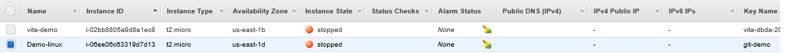
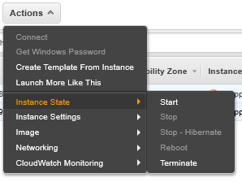
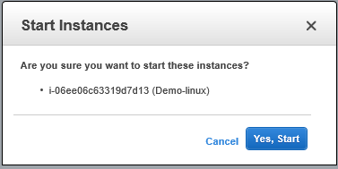
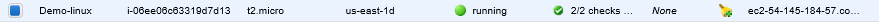
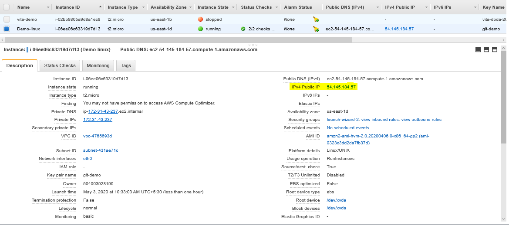
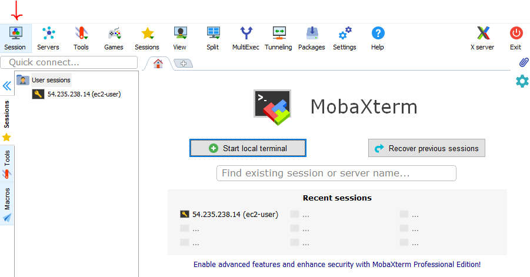
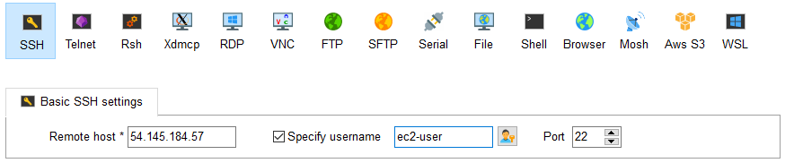
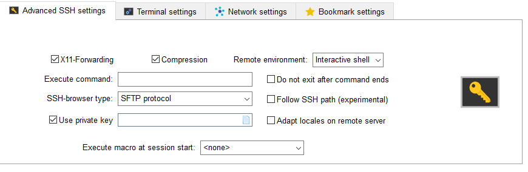
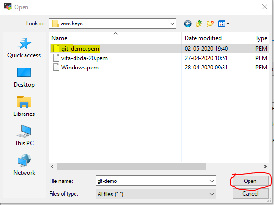
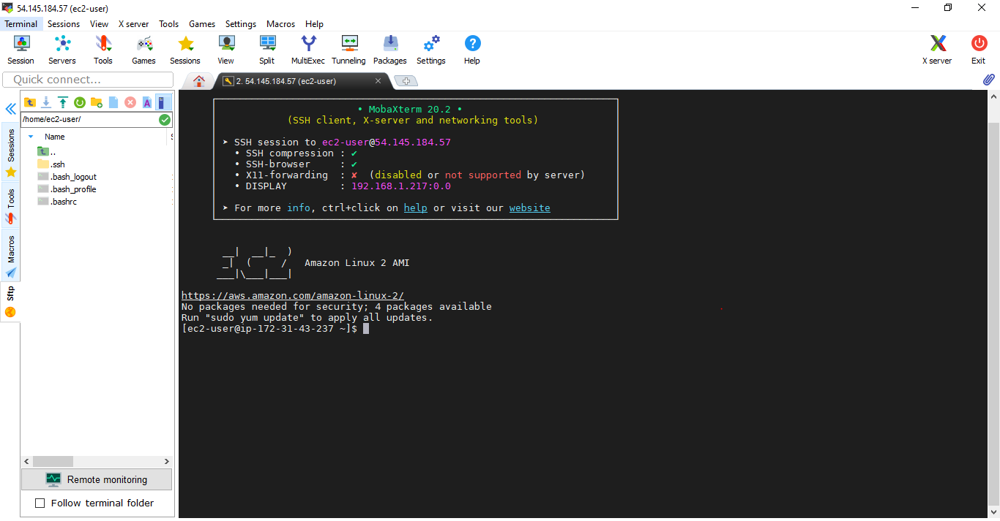

## In The Previous Tutorial We have Created ec2 instance ,
## **Now In This Tutorial We Will remote Login the created instance**

 **Hope you all have installed MobaXterm**
* **If not then download and install Here is the link :**<https://mobaxterm.mobatek.net/download-home-edition.html>

* **if you still unable to install MobaXterm , Go through this Tutorial** <https://www.youtube.com/watch?v=E1rMooFomHM>

## 1. This Is The Instance We Had Created
**Our Instance is in stopped state**

 
 
## 2. To Change Status of instance
 Go to **Action**--> Then **Instance State** --> then **Start**
 
  
  
  
 ## 3. Then Winnows Will Pop-up
  
  Choose **Yes Start**
  
  
   
   
   
   * It Will take some time as you can see in the image below that The instance State is **Pending**
   
   
   

   * Now our instance is in running state
  
  
  
  
  ## 4. Copy the Ipv4 public:IP 
  
  
  
  ## 5. Now Open Your MobaXterm 
  goto **Session**
  
  
  
   ## 6. Go to **SSH**
  In **Remote Host**: Paste The Ipv4 public:IP That we Copied earlier 
  Then check the Specify user 
  We have created the linux instance so our user name is  **ec2-user**
  
  
  
  ## 7. Below you can see **the Advanced SSH Settings**
  **This is Most Important Step**
  **Check Use private key**
  
  
  
  
 ## 8. Now Browse For private key
    We have Saved This File Earlier
    Goto your Folder where you saved you **.pem** file,
    And Hit **Open**
    Without this file you **can't login** 
    
   
    
   ** Now Hit Ok**
    
    
   
    
   ## Connected to your Linux instance using an SSH 
    
   
    
  
 
   
