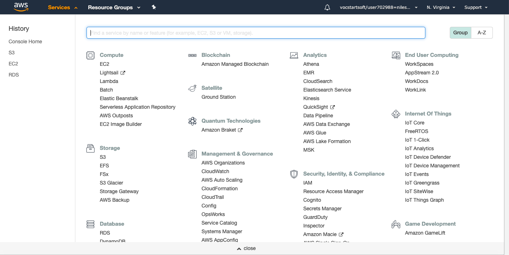
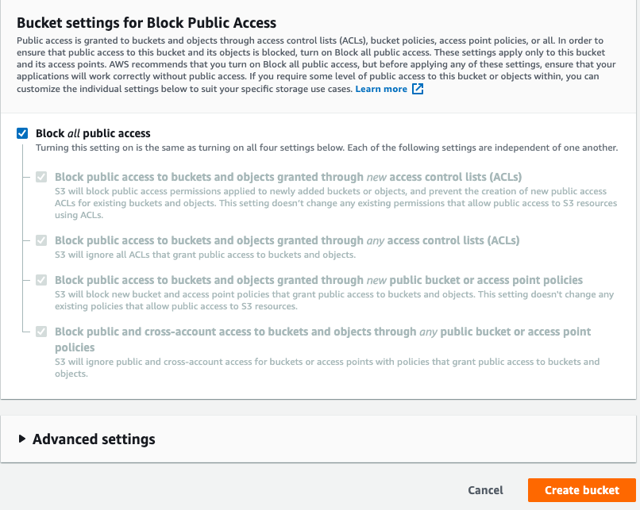
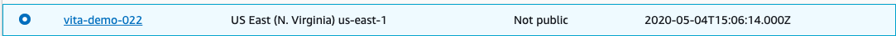
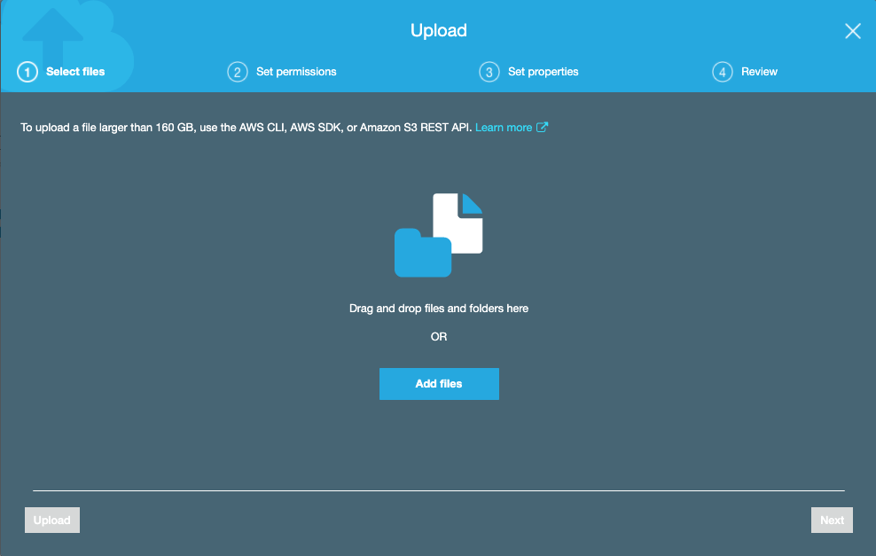
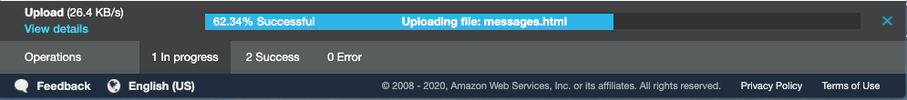

## Amazon Simple Storage Service

* Amazon Simple Storage Service (Amazon S3) is storage for the internet. 
You can use Amazon S3 to store and retrieve any amount of data at any time, 
from anywhere on the web. You can accomplish these tasks using the AWS Management Console, 
which is a simple and intuitive web interface.

* When you sign up for AWS, your AWS account is automatically signed up for all services in AWS, including Amazon S3. 
You are charged only for the services that you use.

**With Amazon S3, you pay only for what you use.**

## Creating a bucket

* **To Create A Bucket**

1. Sign in to the AWS Management Console and open the Amazon S3 console at <https://console.aws.amazon.com/s3/>

2. Goto **Storage** and click **s3**

3. **Choose Create Bucket**

* The Create bucket page opens.

4. In Bucket name, enter a DNS-compliant name for your bucket.

The bucket name must:
    * Be unique across all of Amazon S3.
    * Be between 3 and 63 characters long.
    * Not contain uppercase characters.
    * Start with a lowercase letter or number.
    
 **NOTE:** After you create the bucket, you can't change its name. 
 
 
 
 
 
5. In Bucket settings for Block Public Access, keep the values set to the defaults.
 Leave The Settings Default
 
 
 
 
 
6. **Choose create bucket**

* You've created a bucket in Amazon S3.
 
 
 
 
 
7. This is the bucket we created

 
 
 
 
## Now We will create a folder and add files 

i. Create folder inside this bucket

  
 
 
ii. Give any name to the folder

 
 
 
iii. Now go to folder

 
 
 
 iv. Now hit **UPLOAD**
 
 
  
  
  
  v. Window will pop up
      We have two options we **can drag a file** or **add files** option
  
  
   
   
   
   vi) we will drag a file to upload
   
   
   
    
    
   vii. Now Hit Upload
   
   
   
   
   
   viii. It will start uploading, uploading time depends on size of file
   
   
   
   
   
   ix. File has been uploaded succefully
   
   
   
       
       
   x. If we check the file one window will pop, it contains property ,**object link**
       if your bucket is public any one can access this storage with the help of object link
   
   
   
       
   
   
 
 
 
 
 
 

