## Hosting a static website on Amazon S3

You can use Amazon S3 to host a static website. On a static website, individual webpages include static content. 
They might also contain client-side scripts.

**Login to your aws account**
**Goto Services**
**Storage services**
**S3**

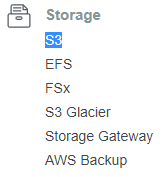

* These Are buckets Available

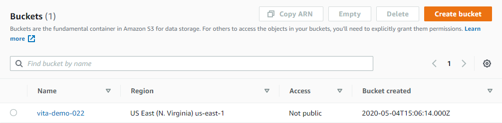

* We will create new folder named **Webhosting**

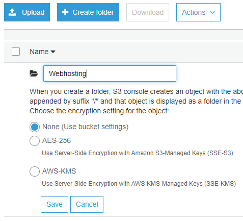

* Folder is created

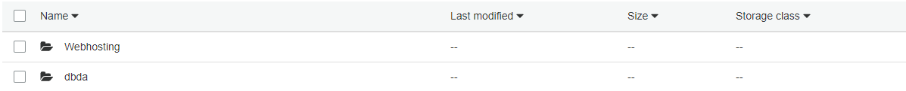

* add our **.html** file in that folder

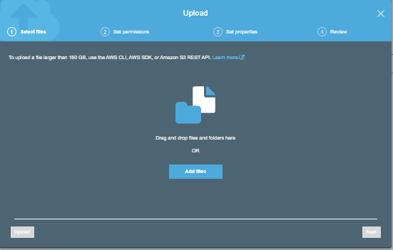

* Hit Upload

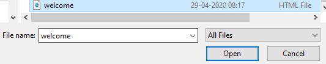

* File has been uploaded succesfully

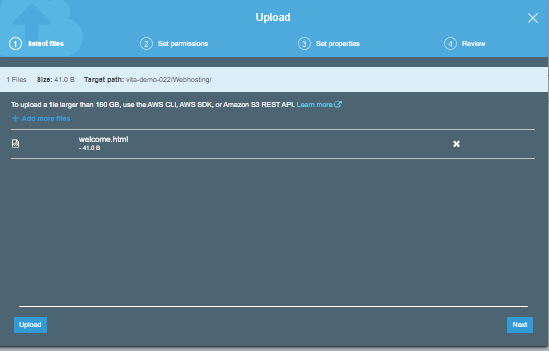

* Now Goto actions and choose **Make Public*
but in the Screen below you can see that make public is disable

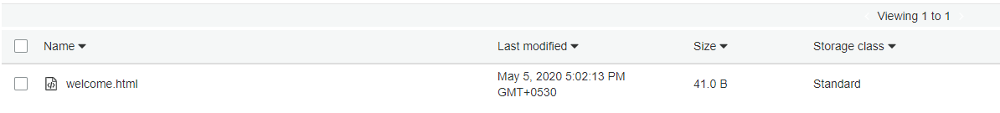

* next step is to make public 
goto overview

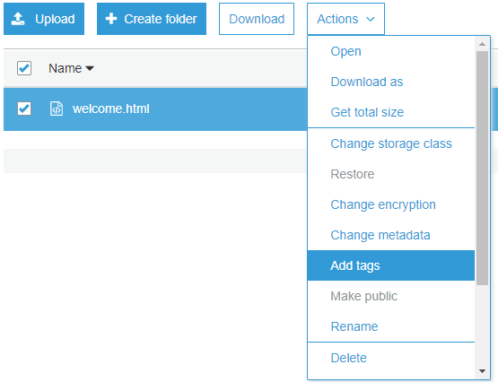

* You will get this page
**you can see that all public access are blocked**

* hit edit and uncheck **block all public access** and **save**

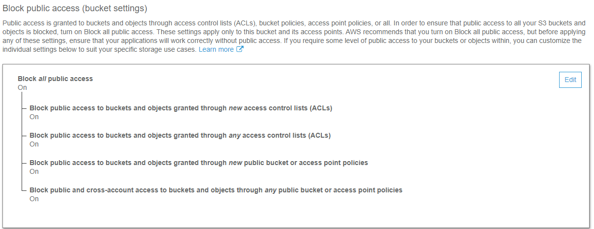

*  I Got a Error, my account is restricted account that why i got exception

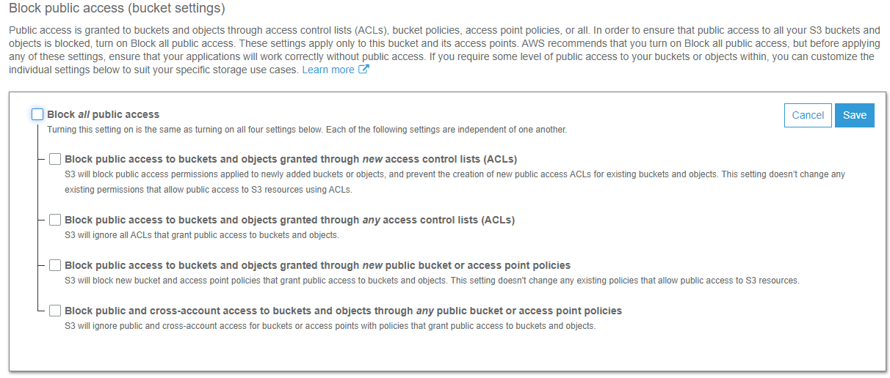

* So we try alternate way to make public access

* goto properties
you will see this interface

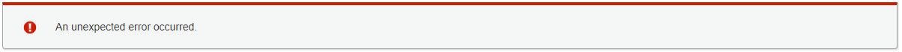

* Check Static Website hosting

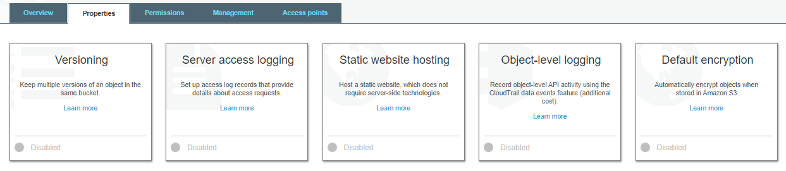

* type fileName.html
in our case the file name is welcome.html
and hit save

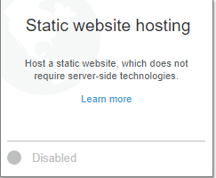

* see that bucket hosting is checked

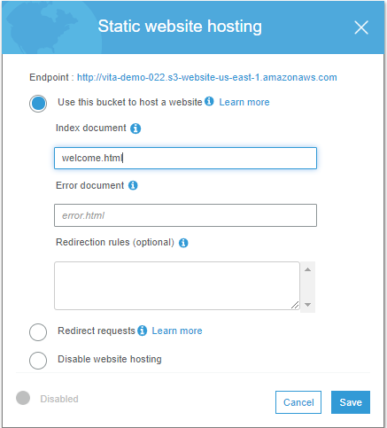

* now go to file then action then make public

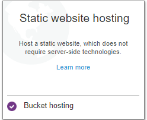

* Hit make public

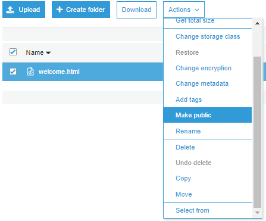

* uncheck and check the file again
you will get a popup window

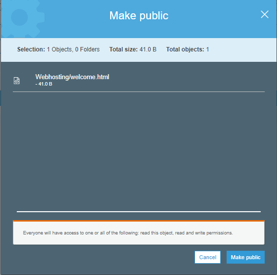

* you can see object url thats the url to our website

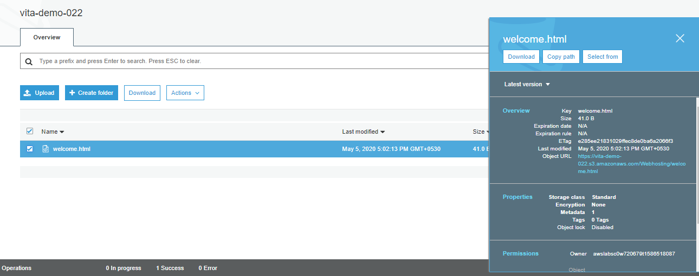

* Hit the url and we are done
This is our basic webpage we just hosted now

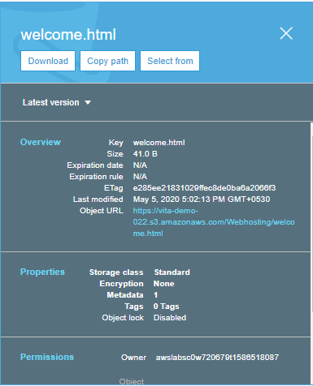

