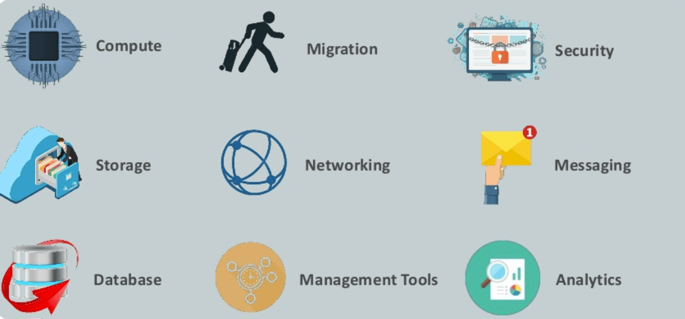

## Cloud computing

**Cloud computing** is the on-demand availability of computer system resources, 
especially **data storage** and **computing power**, without direct active management by the user.
The term is generally used to describe data centers available to many users over the Internet. 
Large clouds, predominant today, often have functions distributed over multiple locations from central servers. 
If the connection to the user is relatively close, it may be designated an edge server. 

## What is AWS?
Amazon web service is a platform that offers flexible, reliable, scalable, easy-to-use and cost-effective cloud computing solutions. 

AWS is a comprehensive, easy to use computing platform offered Amazon. The platform is developed with a combination of infrastructure as a service (IaaS), platform as a service (PaaS) and packaged software as a service (SaaS) offerings. 

## History of AWS
* 2002- AWS services launched 
* 2006- Launched its cloud products
* 2012- Holds first customer event
* 2015- Reveals revenues achieved of $4.6 billion
* 2016- Surpassed $10 billon revenue target
* 2016- Release snowball and snowmobile 
* 2019- Offers nearly 100 cloud services

## Important AWS Services 
Amazon Web Services offers a wide range of different business purpose global cloud-based products. 
The products include storage, databases, analytics, networking, mobile, development tools, enterprise applications, 
with a **pay-as-you-go** pricing model. 

