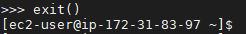
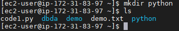
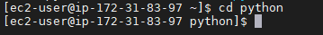
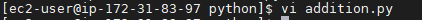
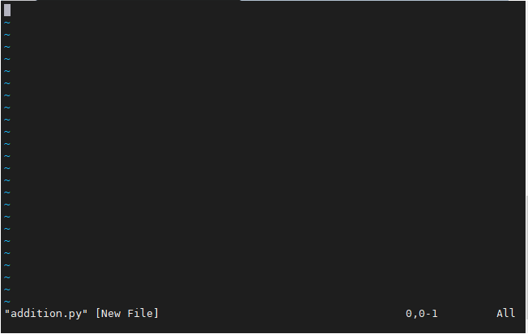
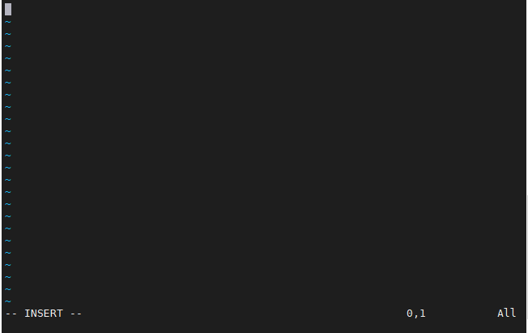
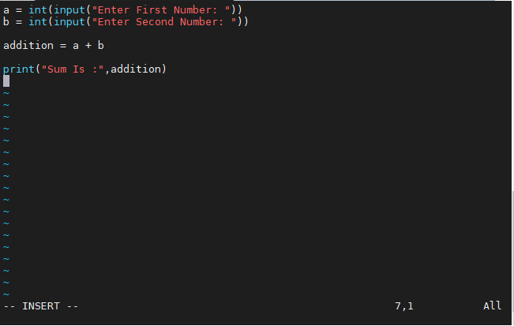
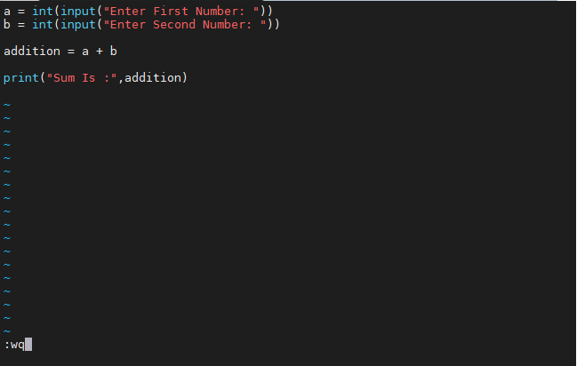
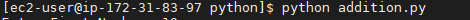
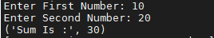

## In this tutorial we will create and execute python program on linux terminal
* open your terminal And Run `python` or `python --version`
* If you have python installed you will get the version of python which is installed or availabe

* we have check the version, now `exit()`

** If you dont have python installed 

**For Linux** `sudo apt-get install python` 
This is the command to install python on linux 

**For Windows/Mac... etc** Below is the link to download python
<https://www.python.org/downloads/>

** IF you are absolute begginer Below is the link on how to install python
<https://www.youtube.com/results?search_query=how+to+install+python>

The First Step is to make directory/Folder by hitting this command `mkdir python`

we created the directory, the `ls` command is used for **Listing Directory Contents**
Now go in the directory We created `cd python`

* Vi is a screen editor for Linux, Unix and other Unix-like operating systems. 
so the next command is `vi addtion.py`

vi ---> is the screen editor for linux
addtion-----> File name or program name
.py ------> extenstion for python .py , for java .java ......etc
when you hit `vi addtion.py` this command the text editor will open

* now Press `i` 

at left bottom you can see we are in insert mode 
now write the program

* To go out of insert mode press **esc**
and then `:wq` to write and quit

* Now we will execute our program by hitting 
`python addition.py`
1. python---> directory name
addition.py ---> program file

* Now it will execute our program 
if our code is errorfree it will ask for inputs
and give output

