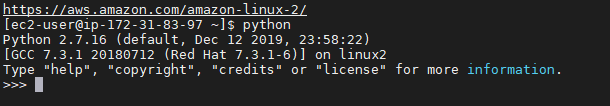

## Python On Linux Terminal
* In this tutorial we will create and execute python program on linux terminal
* open your terminal And Run `python` or `python --version`
*If you have python installed you will get the version of python which is installed or availabe

we have check the version, now `exit()`
